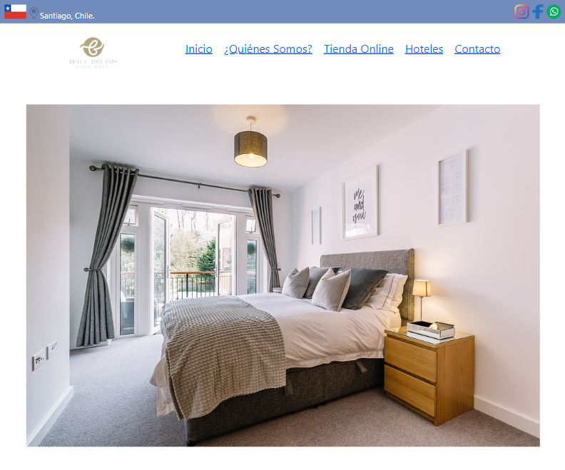

# Bed & Dreams
<p>
    Sitio Web para Bed and Dreams (Proyecto Curso Desarrollador Web CoderHouse)
</p>

## Introducción

<p>
Sitio web para una empresa importadora y fabricante de ropa de cama de lujo, motivado crear una página web personalizable, y en el uso de las herramientas y tecnologías aprendidas a lo largo de las clases del curso de Desarrollo Web de Coder House, cumpliendo con los requisitos para el proyecto final.

La nercesidad de crear un sitio web de ropa de cama para mostrar los productos de alta calidad creados por Beds & Dreams, y poder ofrecerlos de venta en la tienda, y a futuro en la página llegando así a más personas e incrementando así el alcance de compradores, ventas, con una presencia formal en internet.

El sitio web está compuesto de 5 páginas html con estilos css usando sass, full responsive, usando combinaciones de flexbox, grids, bootstrap para mostrar la implemantación de cada una.

Se implementaron mixins, extends, variables y animaciones.
</p>


<p align="center">
    
</p>


## Índice

- [Intrucción](#introducción)
- [Propósito del Proyecto](#propósito-del-proyecto)
- [Tecnologías](#tecnologías)
- [Estructura](#estructura)
- [Créditos](#créditos)


## Propósito del Proyecto

<p>
La página actual de la empresa esta realizada con una plantilla en la plataforma  Jumpseller, lo que limita la personalización.
Por esta razón se realizá esta página para evitar toda la limitación la plataforma, agregando más estilos, campos, y estilos.
</p>


## Tecnologías

<p>
Tecnologias utilizadas:
</p>

- HTML 5
- CSS 3
- SASS
- Bootstrap


## Estructura

```
/
├── .vscode
├── assets
│   ├── fonts
│   └── img
│
├── css
├── pages
├── scss
│   ├── base
│   ├── components
│   ├── layout
│       ├── media-q
│   └── utilities
│
├── .gitignore
├── index.html
├── package-lock.json
├── package.json
└── README.md
```

## Créditos

#### Profesor 
- Maximiliano  Cardenas

#### Tutores Regulares CoderAsk
- Joaquín de la Parra
- Yeison Rodriguez

#### Tutores Adjuntos CoderAsk
- Damian Laterza


